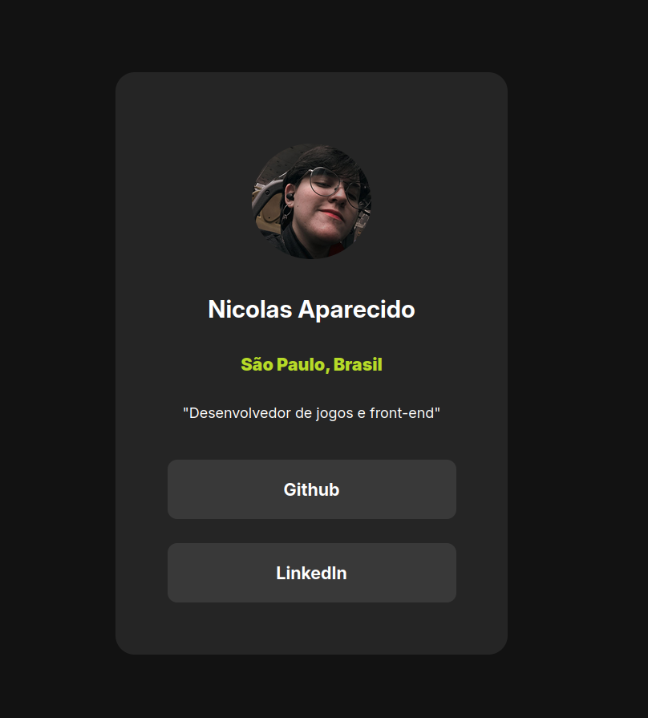

# Profile Social Links

Um cartão de perfil simples e elegante, dark mode por padrão, com links diretos para redes sociais e portfólio. Feito apenas com HTML e CSS.

## 📷 Preview


## ✨ Funcionalidades

- Exibição de foto de perfil, nome, localização e bio
- Botões de acesso rápido para GitHub e LinkedIn
- Animação suave nos botões (hover com leve escala e mudança de cor)
- Dark mode nativo

## 🛠️ Tecnologias


## 🚀 Como rodar

```bash
git clone https://github.com/Nicolass-da-Silva/Social-Links-Profile.git

cd profile-social-links
```

Depois é só abrir o `index.html` no navegador (ou usar uma extensão como Live Server).

## 📌 Status

Projeto de estudo/portfólio, em desenvolvimento.

## 📄 Licença

Este projeto está sob a licença MIT.